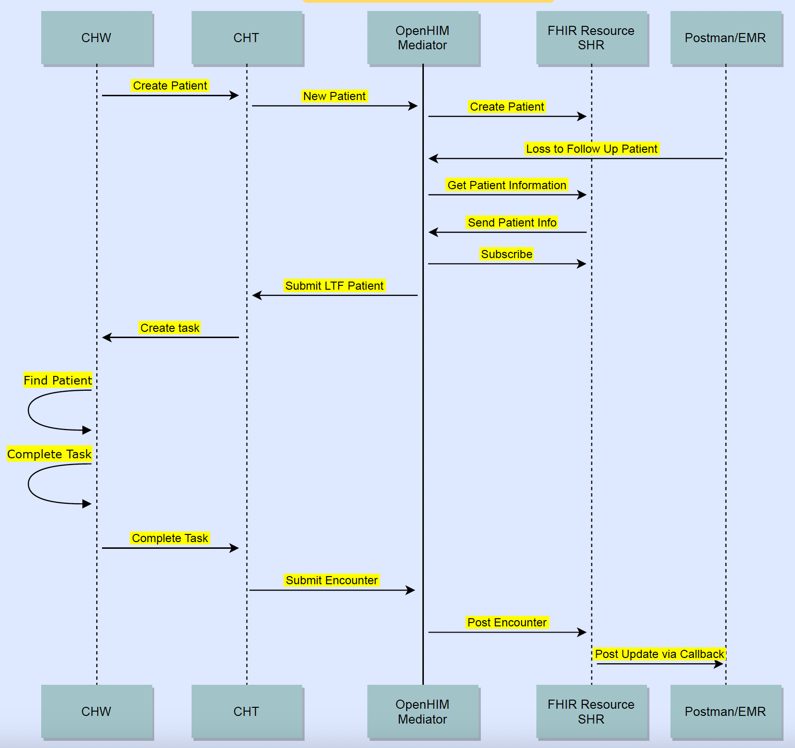

# Infrastructure for Community of Practice (CoP) Interoperability Project

## Overview
This project implements a Loss to Follow Up (LTFU) workflow system for CHIS based on [OpenHIE LTFU Guide](https://wiki.ohie.org/display/SUB/Use+Case+Summary:+Request+Community+Based+Follow-Up).

A first version of the project can be found in the [chis-interoperability](https://github.com/medic/chis-interoperability) repository.

### Services
Services are currently available at these URLs:

* **OpenHIM Admin Console** - TODO
* **OpenHIM Mediator** - TODO 
* **HAPI FHIR** - TODO
* **CHT with LTFU configuration** - TODO

### Workflow Diagram
 

## Get Started

### Prerequisites
- `docker`

### Install & First Time Run

1. Run `./startup.sh init` to start-up the docker containers on the first run or after calling `./startup.sh destroy`. Use `./startup.sh up` for subsequent runs after calling `init` without calling `destroy`.

1. Visit the OpenHIM Admin Console at http://localhost:9000 and login with the following credentials: email - `interop@openhim.org` and password - `interop-password`. The default User username for OpenHIM is `interop@openhim.org` and password is `interop-password`. The default Client username is `interop-client` and password is `interop-password`.

1. Once logged in, visit http://localhost:9000/#!/mediators and select the only mediator with the `Name` 'Loss to Follow Up Mediator'.

1. Select the green `+` button to the right of the default channel to add the mediator.

1. You can test the mediator by running `curl -X GET http://localhost:5001/mediator -H "Authorization: Basic $(echo -n interop-client:interop-password | base64)"`. You should get the following response `{"status": "success" }`.

1. If the curl request fails, visit http://localhost:9000/#!/clients and click on the icon the red arrow points to in the image below.

 If everything is successful you should see this 

### Shutdown the servers

- To shut-down the containers run `./startup.sh down` to stop the instances.
- To then restart the containers, run `./startup.sh up`. You do not need to run init again like you did in install above.
- To shut-down and delete everything, run `./startup.sh destroy`.

Users getting errors when running the installation steps, please see the [Troubleshooting guide](/troubleshooting.md).
